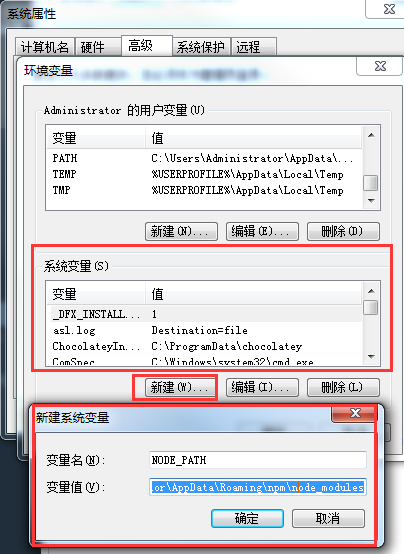
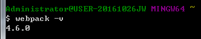

#### 初始化项目 ####

```
npm install
```

#### 开发环境 ####

```
npm run dev
```

[http://localhost:8080/][1]

#### 生产环境打包 ####
```
npm run build
```

  [1]: http://localhost:8080/


#### 遇到的一些问题  ####
##### 1).window上安装webpack报错 #####

```
$ webpack-v
bash: webpack-v: command not found
```

需要配置系统变量

```
NODE_PATH
C:\Users\Administrator\AppData\Roaming\npm\node_modules
```



然后重启gitbash，成功



##### 2). ######
```
WARNING in configuration
The 'mode' option has not been set, webpack will fallback to 'production' for this value. Set 'mode' option to 'development' or 'production' to enable defaults for each environment.
You can also set it to 'none' to disable any default behavior. Learn more: https://webpack.js.org/concepts/mode/
```
加--mode development  --mode production
```
"scripts": {
    "dev": "cross-env NODE_ENV=development webpack-dev-server --mode development --config webpack.config.js",
    "build": "cross-env NODE_ENV=production webpack --mode production --config webpack.config.js"
},
```

##### 3).npm install html-webpack-plugin #####
```
const HtmlWebpackPlugin = require('html-webpack-plugin');
...
//插件
plugins:[
    //用来自动产出html文件，并且向里面插入打包后的js文件
    new HtmlWebpackPlugin({
        template: './index.html'
    })
]
```
##### 4).webpack的配置问题 #####

```
resolve: {
extensions: [".js", ".json", ".san"],
```

```
import Hello from './todo/Hello'
```

resolve需要配置扩展属性，不然模板import引用不到，需要加上后缀
```
import Hello from './todo/Hello.san'
```

##### 5).npm install cross-env 跨环境插件(win,mac,linux) #####

同时修改package.json文件
```
"dev": "cross-env NODE_ENV=development webpack-dev-server --mode development --config webpack.config.js --open",
"build": "cross-env NODE_ENV=production webpack --mode production --config webpack.config.js"
```

##### 5).踩到的一些坑的参考资料  #####

https://blog.csdn.net/jiang7701037/article/details/79403637

https://blog.csdn.net/csdn_yudong/article/details/79781842

https://www.cnblogs.com/yanze/p/7879631.html

https://www.cnblogs.com/MainActivity/p/8011488.html

https://www.cnblogs.com/qqfontofweb/p/8516882.html

https://segmentfault.com/q/1010000009511630


